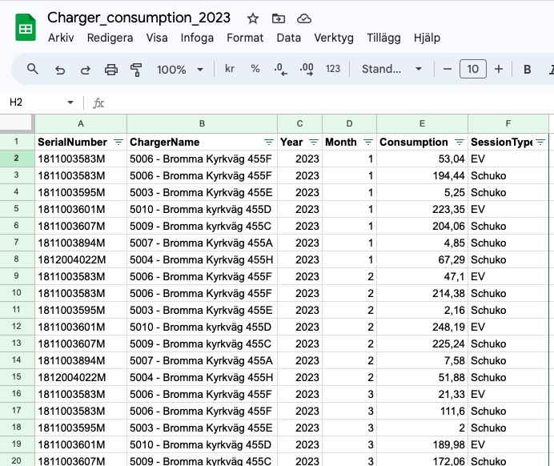
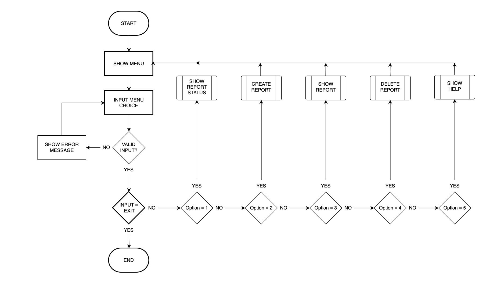
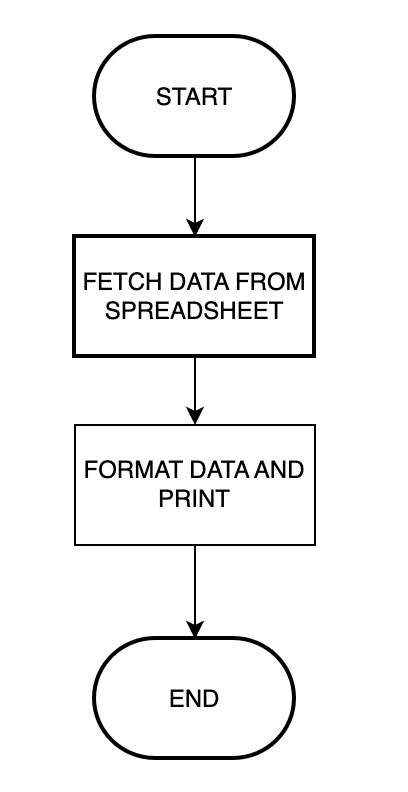
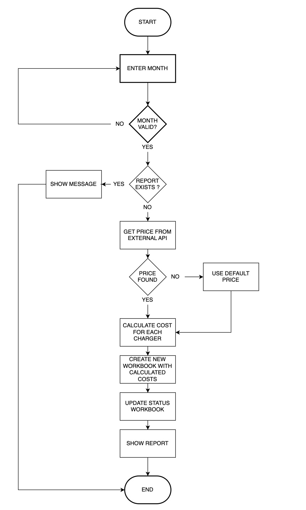
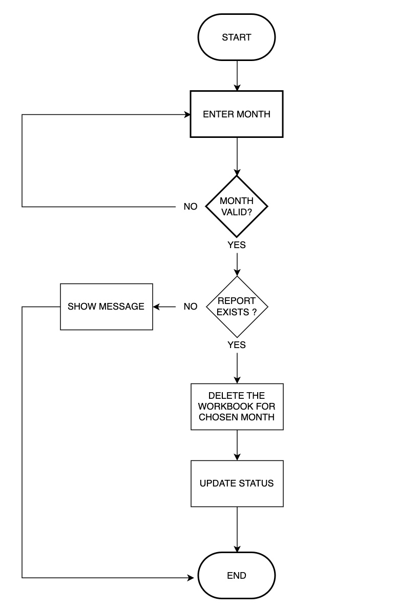

# ECCS - Eletricity Cost Calculation System
ECCS (Electricy Cost Calculation System) is a system for managing and calculating costs for the use of charging stations in a housing cooperative. Each month, the cooperative must submit billing documentation to its financial manager, who then sends out invoices to the households. With ECCS, the cooperative can create this documentation without needing to make manual changes to the spreadsheet that can be extracted from the charging station system.

The system automatically prepares the billing information based on data pulled from the charging stations, eliminating the need for manual adjustments to spreadsheets before sending them to the financial administrator for invoicing. This ensures accuracy and saves time for the cooperative.

The live link can be found here - [ECCS Admin](https://)

## User Stories

- ### As a user I want to:
  - Get an overview of which reports have been created and when
  - Be able to create a report for a specific month
  - Enter my own electricity price or choose to use a retrieved electricity price
  - Be able to recreate a report if necessary
  - View a report for a specific month

## The data
Through the Charge Amps administration interface, the cooperative's administrator can export reports on the electricity consumption for the various charging stations over a specific period. The report includes details about the charging station's serial number, name, consumption, and type of charging.

## User experience
In order to visualise the flow of 

## Flow charts

Flow chart for main menu

### Main menu:

Flow chart for Show Status

### Show status:

Flow chart for Create Report

### Create report:

Flow chart for Show Report

### Show report:

Flow chart for Delete Report

### Delete report:

## Features

### Main menu
- When the user enters the site 

- There is strong data validation 

Error handling

### Register price
- If the u
- Elpris api
- input validation

### Create report
- The user is i

### Erase month
- The following

### Show status
- The 

### Help
- Once 

### Exit
- If the player use

### Future Features
- The user 

## Data Model

I'm not sure what to write here...

## Testing

### PEP8 Testing
The python files have all been passed through [PEP8 Online](http://pep8online.com/). All python files were checked with no errors reported. See screen show below:

### Manual testing
All user inputs were tested thoroughly to ensure all input data is handled correctly and appropriate feedback is given to the user as follows:

### Unit tests
The 

## Libraries and Technologies Used

### Python Libraries:

- [os](https://docs.python.org/3/library/os.html?highlight=os#module-os) 
  - `os.system` is used in order to clear the terminal 
- [datetime](https://pypi.org/project/DateTime/): used to get today's date when report is created
- [gspread](https://pypi.org/project/gspread/): to allow communication with Google Sheets. 
- [requests](https://pypi.org/project/requests): enables data retrieval from elprisetjustnu.se.
- [google.oauth2.service_account](https://google-auth.readthedocs.io/en/stable/index.html):  
- [pyfiglet](https://pypi.org/project/pyfiglet/0.7/) - Not sure if i'll use this...
- [colorama](https://pypi.org/project/colorama/) - for adding colour to terminal text.

### Programs Used

- [GitHub](https://github.com/) - used for version control.
- [Heroku](https://dashboard.heroku.com/apps) -  used to deploy the live project.
- [Draw IO]
- [PEP8 Online](http://pep8online.com/) - used to validate all the Python code
- [Grammerly](https://app.grammarly.com/) - used to proof read the README.md

## Known Bugs

Github issues

## Fixed Bugs

Github issues

### Bug 1

### Bug 2

## Deployment

The site was deployed via [Heroku](https://dashboard.heroku.com/apps), and the live link can be found here: 

Before deploying to Heroku pip3 freeze > requirements.txt was used to add all the dependencies required to the requirements.txt file. This is required for the game to run on Heroku.

The following steps were then taken:
1. Log in to [Heroku](https://dashboard.heroku.com/apps) or create an account.
2. On the main page click the button labelled New in the top right corner and from the drop-down menu select "Create New App".
3. Enter a unique and meaningful app name.
4. Next select your region.
5. Click on the Create App button.
6. Click on the Settings Tab and scroll down to Config Vars.
7. Click Reveal Config Vars and enter port into the Key box and 8000 into the Value box and click the Add button.
8. Input CREDS and the content of your Google Sheet API creds file as another config var and click add.
9. In the next Key box enter OXFORD_API_APP_ID and add your unique ID to the value box. 
10. In the next Key box enter OXFORD_API_APP_KEY and add your unique key to the value box. 
11. Next, scroll down to the Buildpack section click Add Buildpack select Python and click Save Changes
12. Repeat step 11 to add node.js. Note: The Buildpacks must be in the correct order. If not click and drag them to move into the correct order.
13. Scroll to the top of the page and choose the Deploy tab.
14. Select Github as the deployment method.
15. Confirm you want to connect to GitHub.
16. Search for the repository name and click the connect button.
17. Scroll to the bottom of the deploy page and either click Enable Automatic Deploys for automatic deploys or Deploy Branch to deploy manually. Manually deployed branches will need re-deploying each time the repo is updated.
18. Click View to view the deployed site.

The site is now live and operational.

## Credits 
### Resources Used
- [W3Schools](https://www.w3schools.com/)  
- [Stack Overflow](https://stackoverflow.com/)

## Acknowledgments
