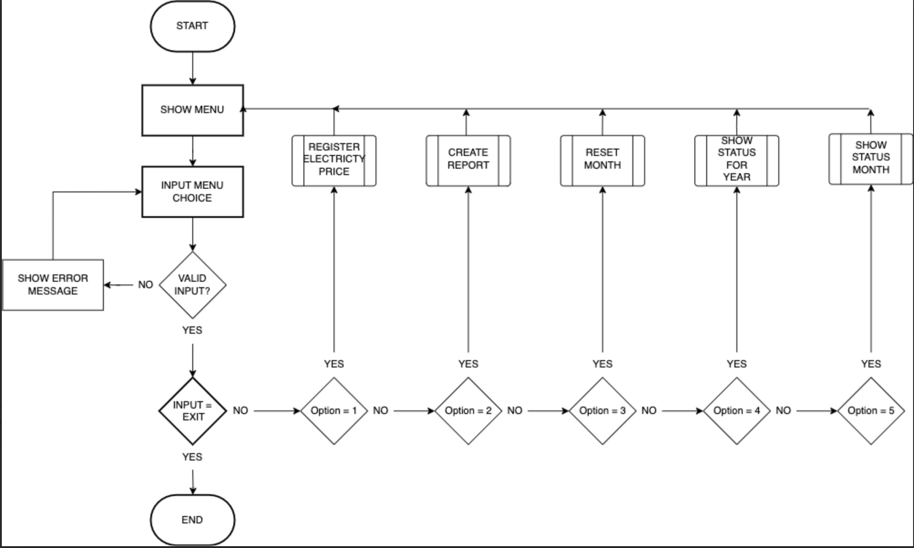
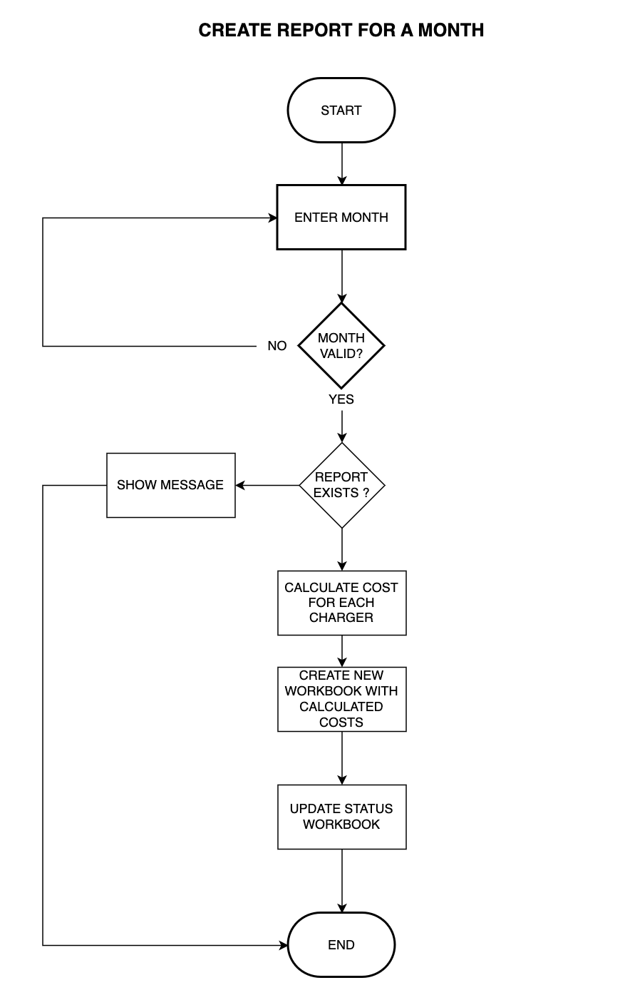

# ECCS - Eletricity Cost Calculation System
ECCS (Electricy Cost Calculation System) is a system for managing and calculating costs for the use of charging stations in a housing cooperative. Each month, the cooperative must submit billing documentation to its financial manager, who then sends out invoices to the households. With ECCS, the cooperative can create this documentation without needing to make manual changes to the spreadsheet that can be extracted from the charging station system.

The system automatically prepares the billing information based on data pulled from the charging stations, eliminating the need for manual adjustments to spreadsheets before sending them to the financial administrator for invoicing. This ensures accuracy and saves time for the cooperative.

The live link can be found here - [ECCS Admin](https://)

## User Stories

- ### As a user I want to:
  - Get an overview of which reports have been created and when
  - Be able to create a report for a specific month
  - Enter my own electricity price or choose to use a retrieved electricity price
  - Be able to recreate a report if necessary
  - View a report for a specific month

## The data
Through the Charge Amps administration interface, the cooperative's administrator can export reports on the electricity consumption for the various charging stations over a specific period. The report includes details about the charging station's serial number, name, consumption, and type of charging.

## User experience
In order to visualise the flow of 

## Flow charts

Flow chart for main menu

### Main menu:

Flow chart for Create Report

### Create report:

Flow chart for Delete Report

### Delete report:

Flow chart for Show Status

### Show status:

Flow chart for Show Report

### Show report:

## Features

### Main menu
- When the user enters the site 

- There is strong data validation 

Error handling

### Register price
- If the u
- Elpris api
- input validation

### Create report
- The user is i

### Erase month
- The following

### Show status
- The 

### Help
- Once 

### Exit
- If the player use

### Future Features
- The user 

## Data Model
I used principles of **Object-Oriented Programming** throughout this project. The Word-Py game consists of three classes:

- Game
- WordChecker
- OxfordDictAPI

The `Game` object is responsible for controlling the flow of the game. It handles things like taking the user input and presenting data back to the user. It contains methods for the general running of the game such as displaying the introduction, displaying user options, taking user guesses, displaying guesses, updating the leader board and displaying the leader board.

The `WordChecker` object is responsible for all actions related to checking the user-provided "guess" input against the generated "answer". This includes validating the input, handling any errors and building the colour-coded response which is returned to the `Game` instance.

The `OxfordDictAPI` object communicates with the [Oxford Dictionaries API](https://developer.oxforddictionaries.com/). This class gets the API credentials from the env.py file and sends a request against this API to ensure the user-provided guess is a valid English word (it exists in the Oxford English Dictionary).

When the game is first run, an initial method is used to retrieve an “answer” word from a text file. This word is then passed as a parameter when creating the `WordChecker` instance. This `WordChecker` instance is then passed as a parameter to the `Game` instance.

The `Game` class then renders the introduction screen and prompts the user for their first guess. User input is passed to `WordChecker` in which it’s validated and then used to return the colour-coded letters to the user via `Game`. `Game` will continue to ask the user for guesses using a while loop until the word has been correctly identified, or the max number of guesses are used.

This modular approach to object definition meant that all of the functionality for running the game, checking the user guess and communicating with the Oxford API were all self-contained within their own classes. This made it easier to develop and also much easier to troubleshoot when things didn't work as initially expected.

## Testing

### PEP8 Testing
The python files have all been passed through [PEP8 Online](http://pep8online.com/). All python files were checked with no errors reported. See screen show below:

### Manual testing
All user inputs were tested thoroughly to ensure all input data is handled correctly and appropriate feedback is given to the user as follows:

### Unit tests
The 

## Libraries and Technologies Used

### Python Libraries:

- [random](https://docs.python.org/3/library/random.html?highlight=random#module-random) - `random.choice` is used to select a random word for the game from a text file.
- [os](https://docs.python.org/3/library/os.html?highlight=os#module-os) 
  - `os.system` is used in order to clear the terminal when beginning a new game.
  - `os.environ` is used to get Oxford API credentials from environment variables (defined in env.py).
- [datetime](https://pypi.org/project/DateTime/): used to get today's date for the leaderboard entry.
- [gspread](https://pypi.org/project/gspread/): to allow communication with Google Sheets. 
- [requests](https://pypi.org/project/requests): enables data retrieval from APIs.
- [google.oauth2.service_account](https://google-auth.readthedocs.io/en/stable/index.html):  used to validate credentials and grant access to google service accounts.
- [pandas](https://pypi.org/project/pandas/) - used for sorting and displaying leaderboard data in user-friendly format.  
- [pyfiglet](https://pypi.org/project/pyfiglet/0.7/) - for taking ASCII text and rendering it into ASCII art fonts.
- [colorama](https://pypi.org/project/colorama/) - for adding colour to terminal text.

### Programs Used

- [GitHub](https://github.com/) - used for version control.
- [Heroku](https://dashboard.heroku.com/apps) -  used to deploy the live project.
- [Lucidchart](https://lucid.app/documents#/dashboard) -  used to create the game flowchart
- [PEP8 Online](http://pep8online.com/) - used to validate all the Python code
- [Grammerly](https://app.grammarly.com/) - used to proof read the README.md

## Known Bugs

Github issues

## Fixed Bugs

Github issues

### Bug 1

### Bug 2

## Deployment

The site was deployed via [Heroku](https://dashboard.heroku.com/apps), and the live link can be found here: [Word-Py](https://word-py.herokuapp.com/)

Before deploying to Heroku pip3 freeze > requirements.txt was used to add all the dependencies required to the requirements.txt file. This is required for the game to run on Heroku.

The following steps were then taken:
1. Log in to [Heroku](https://dashboard.heroku.com/apps) or create an account.
2. On the main page click the button labelled New in the top right corner and from the drop-down menu select "Create New App".
3. Enter a unique and meaningful app name.
4. Next select your region.
5. Click on the Create App button.
6. Click on the Settings Tab and scroll down to Config Vars.
7. Click Reveal Config Vars and enter port into the Key box and 8000 into the Value box and click the Add button.
8. Input CREDS and the content of your Google Sheet API creds file as another config var and click add.
9. In the next Key box enter OXFORD_API_APP_ID and add your unique ID to the value box. 
10. In the next Key box enter OXFORD_API_APP_KEY and add your unique key to the value box. 
11. Next, scroll down to the Buildpack section click Add Buildpack select Python and click Save Changes
12. Repeat step 11 to add node.js. Note: The Buildpacks must be in the correct order. If not click and drag them to move into the correct order.
13. Scroll to the top of the page and choose the Deploy tab.
14. Select Github as the deployment method.
15. Confirm you want to connect to GitHub.
16. Search for the repository name and click the connect button.
17. Scroll to the bottom of the deploy page and either click Enable Automatic Deploys for automatic deploys or Deploy Branch to deploy manually. Manually deployed branches will need re-deploying each time the repo is updated.
18. Click View to view the deployed site.

The site is now live and operational.

## Credits 
### Resources Used
- [W3Schools](https://www.w3schools.com/)  
- [Stack Overflow](https://stackoverflow.com/)
- [5 Letter Words List](https://7esl.com/5-letter-words/) - The list of five-letter words used in the game was taken from this site.
- [Count occurrences of a character in a string](https://stackoverflow.com/questions/1155617/count-the-number-of-occurrences-of-a-character-in-a-string) - I read about the Collections Counter method in this post.
- [How to set up environment variables in GitPod](https://code-institute-room.slack.com/archives/CP07TN38Q/p1576743956008500) - This post from anna_ci in the Code Institute slack channel was very informative and enabled me to set up my environment variables correctly for my API key. 
- [ASCII Art](https://www.asciiart.eu/art-and-design/borders) - I used this ASCII art for the border around the instructions.
- [How to get current date and time in Python](https://www.programiz.com/python-programming/datetime/current-datetime) - I used this article to learn about the strftime() method when getting the date for my leaderboard.
- [Pandas Sort: Your Guide to Sorting Data in Python](https://realpython.com/pandas-sort-python/) - I used this article to learn how to sort the leaderboard data for the table.
- [Center align column headers of a Pandas DataFrame](https://www.tutorialspoint.com/python-center-align-column-headers-of-a-pandas-dataframe) - I used this article when formating the leaderboard table.
- [Oxford Dictionary API Docs](https://developer.oxforddictionaries.com/documentation/getting_started) - This documentation came in useful when implementing the Oxford Dictionary API.
- I followed the steps in the Code Institute Python walkthrough project - Love Sandwiches when setting up my Google Sheets API.

## Acknowledgments

The Code Institute slack community for their quick responses and very helpful feedback!