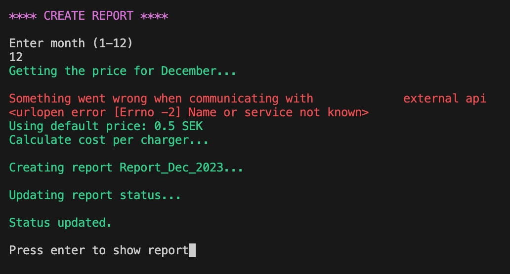
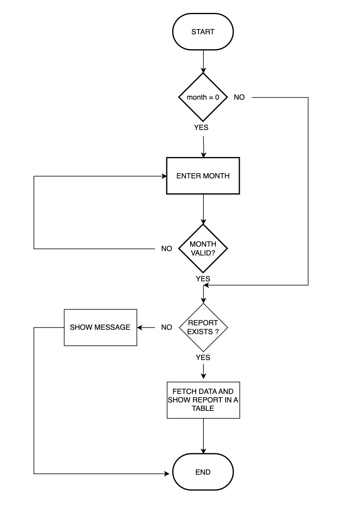

# ECCS - Eletricity Cost Calculation System
ECCS (Electricy Cost Calculation System) is a system for managing and calculating costs for the use of charging stations in a housing cooperative. Each month, the cooperative must submit billing documentation to its financial manager, who then sends out invoices to the households. With ECCS, the cooperative can create this documentation without needing to make manual changes to the spreadsheet that can be extracted from the charging station system.

The system automatically prepares the billing information based on data pulled from the charging stations, eliminating the need for manual adjustments to spreadsheets before sending them to the financial administrator for invoicing. This ensures accuracy and saves time for the cooperative.

The live link can be found here - [ECCS Admin](https://eccs-admin-e9a21a8f9cef.herokuapp.com/)

## User Stories

### As a user I want to:
  - Get an overview of which reports have been created and when
  - Be able to create a report for a specific month
  - Retrieve the electricity price from an external api
  - Be able to recreate a report if necessary
  - View a report for a specific month

## The data
Through the Charge Amps administration interface, the cooperative's administrator can export reports on the electricity consumption for the various charging stations over a specific period. The report includes details about the charging station's serial number, name, consumption, and type of charging.

To manage reports and report tracking, the following worksheets have been added to the spreadsheet:
- Status_2023:
  - Status for every month. Contains price, report name (if created) and date when the report was created.
- For each created report therw will be a corresponding worksheet (f ex Report_Jan_2023 etc)

## Design
The application has been designed with simplicity and a smooth user experience in mind with respect to the choice of colors, status messages, etc.

### Colors
The colors used are chosen both to make the application more appealing and to indicate the type of information being presented. For example, red is used for error messages, green for successful operations, and white when the user is expected to make a selection. The headings on the pages are the same color across different pages to facilitate navigation.

### Page design
When the user has made their selection from the main menu, the screen is cleared before the new page is displayed to make it clear to the user that they have left the menu. The heading is clearly displayed at the top of the new page. When the application has completed what the user has requested, the user is prompted to press Enter to proceed. This is to indicate that the task has been completed.

### Status messages
To facilitate the user experience, different types of status messages are used when various tasks are performed. For example, on the Create Report page, messages are displayed when the price is fetched from the external API, which price was fetched, when the report is being created, and when it has been created, etc

### Tables
Data from the spreadsheet is displayed in table format. This is partly because it resembles the way data is displayed in the spreadsheet, but also for clarity.

## Features

### Main menu
When the application starts, the main menu is displayed where the user can 
choose from six different options.

When the user selects an option, the input value is validated to ensure that 
only an integer between 1 and 6 (inclusive) is accepted. If an incorrect value 
(such as a string) is entered, an error message is displayed and the user is 
prompted to make a new choice.

When the application starts, some initializations are made. Among other things, the spreadsheet with the consumption data is read. If an error occurs then (such as the spreadsheet not being available), it is handled. A message is shown, urging the user to try again later since the data could not be loaded. 

When the user has made their choice in the menu and the respective function is called, all general errors are handled with try-except in main. Certain specific errors are handled in the called function.

Flow chart for main menu

##### Main menu:

### Show report status
The purpose of the report status page is to give the user an overview of which reports have been created and the price used. When a report is created, the name of the report and the date it was created are also saved.

Flow chart for Show Status

##### Show status:

### Create report
When the user selects the option 'Create Report' from the menu, they are prompted to choose month. After the user enters a valid month number, the electricity price for that particular month is fetched from https://www.elprisetjustnu.se/elpris-api. Once the average price is calculated, the cost for each household is determined using the consumption data (from the consumption worksheet) and the calculated average price. Then, the report is created and added as its own worksheet in the spreadsheet. Thereafter, the status table is updated with information about the electricity price used, the name of the report, and the date the report was created.

After the user presses enter, the report is displayed in the same way as if the menu option Show Report had been selected.

If there is already a report for the selected month, an error message is displayed. After the user presses enter, the main menu is displayed.

If the electricity price cannot be retrieved from the external API, a message will be displayed about this and that a default price will be used instead. Reasons for not being able to retrieve the price could be that the site is down or that the site does not respond within the specified timeout period (currently 5 seconds).

Flow chart for Create Report

##### Create report:

### Show report
When the user has enter a valid month number the report for the chosen month is shown in a table. The data is retrieved for the report worksheet in the spreadsheet. 

If the user selects a month that does not have a report, an error message is displayed.

Flow chart for Show Report

##### Show report:

### Delete report
When the user selects the option 'Create Report' from the menu, they are prompted to choose month the report should cover. After the user enters a valid month number, a status message is displayed about which report has been removed. Then, status messages about the update of the status are displayed.

If the user selects a month that does not have a report, an error message is displayed.

Flow chart for Delete Report

##### Delete report:

### Help
When the user selects Help from the menu, a page with some simple instructions is displayed.

### Exit
Exits the application.

### Future improvements
- Option to send report to the financial manager.
  - One of the few manual tasks remaining is to email the monthly report to the financial manager. This could be done from the E C C S.
- Limit the ability to delete reports.
  - It is currently necessary to be able to delete reports, but going forward, this capability should be limited. Once a report has been sent to the financial manager, it should not be possible to delete it
-  Config file
  - External configuration file with various setting options, such as color choices, messages, timeout periods, etc.
- Adjustments for 2024
- Logging

## Testing

### Manual testing
Four different types of tests have been performed:
- Functional tests
  - To test that the application works as intended when input is the expected.
- Validation tests
  - To test that the application can handle various types of incorrectly entered values that could cause the application to crash. Unit tests have been used for these tests.
- Manual validation tests
  - To test that the application can handle when the user tries to delete a report that does not exist or create a report that already exists.
- Exception handling tests
  - The handling of unexpected events has been tested by manipulating the code to provoke errors and thereby verify that they are handled correctly.

Click below to see the results of the conducted tests for each test type.

Functional tests

The help page was added after the tests had been conducted, but has now been tested with satisfactory results.

Validation tests (unit tests)

Validation tests

Exception handling tests

### PEP8 Testing
The python files have all been passed through [CI Python Linter](https://pep8ci.herokuapp.com/#). All python files were checked and the errors have been fixed.

## Libraries and Technologies Used

### Python Libraries:

- [gspread](https://pypi.org/project/gspread/): to allow communication with Google Sheets. 
- [requests](https://pypi.org/project/requests): enables data retrieval from elprisetjustnu.se.
- [google.oauth2.service_account](https://google-auth.readthedocs.io/en/stable/index.html) 
- [colorama](https://pypi.org/project/colorama/) - for adding colour to terminal text.
- [prettytable](https://pypi.org/project/prettytable/) - to display the data in table format.

### Programs Used

- [GitHub](https://github.com/) - used for version control.
- [Heroku](https://dashboard.heroku.com/apps) -  used to deploy the project.
- [draw.io](https://app.diagrams.net/) - used to make flowcharts
- [CI Python Linter](https://pep8ci.herokuapp.com/#) - used to validate all the Python code

## Known Bugs

#### The terminal does not clear completely after the status list has been displayed.
When option 1 is selected and the status list for all months is displayed, the terminal does not clear correctly. The list is taller than the terminal window, and when returning to the menu, it is possible to scroll the terminal window, showing the last rows from the status table. This does not affect functionality and is only visible if one scrolls; otherwise, the pages appear as intended with the menu at the top. Currently, it is unclear whether this is a bug in how the terminal is implemented in Heroku or if there is a way to circumvent the problem by modifying the code. The bug will not be addressed at this time.

## Deployment

Set up the API and connect your spreadsheet to the project.

  1. Go to [Google Cloud Platform](https://console.cloud.google.com/)
  2. Click on "Select a project" in the blue banner near the top of the page.
  3. Then click on "New project".
  4. Give the project a name and click "Create".
  5. After the project has been created, click "Select project" to get to the project page.
  6. In the menu at the left hand side, select *API's and Services*, then select *Library*.
  7. Find and click on the *Google Drive API*, then click on *Enable*.
  8. When enabling the API, you should land on the *Overview* page for the Google Drive API. Here, click *Create credentials* in the upper right corner.
  9. Fill out the form with the values below:
      - Which API's are you using?: Google Drive API
      - What data will you be accessing?: Application data
        - Click *Next*
      - Service account name: [choose a name to give the service account]
        - Click *Create and continue*
      - Role: Editor
        - Click *Continue*
      - Click *Done*
  10. In the menu on the left hand side, click *Credentials*
  11. In the section "Service Accounts", find and click on the account that was created.
  12. On the next page, in the menu on the top of the page, click on *Keys*
  13. Click on *Add key* -> *Create new key*.
  14. Select *JSON* as the "Key type" and click *Create*. This should download the key to your computer.
  15. In the menu on the left hand side, select *API's and Services* -> *Library* to get back to the "Library" page.
  16. Find and enable the *Google Sheets API*
  17. Move the file that was downloaded from *Google Cloud Platform* into your local copy of the repository.
  18. Rename the file *creds.json*. This is __important__, since there is already code in the *run.py* file stating the credentials are in the file *creds.json*
  19. Open *creds.json*, and copy the value of client email, without the quotes.
  20. Now go back to your spreadsheet. Click *Share* in the upper right corner, and paste in the email address. Make sure the role is "Editor", then click *Send*.

#### Deploy to Heroku

Before deploying to Heroku pip3 freeze > requirements.txt was used to add all the dependencies required to the requirements.txt file. This is required for the application to run on Heroku.

Deploy steps

1. Log in to [Heroku](https://dashboard.heroku.com/apps) or create an account.
2. On the main page click the button labelled New in the top right corner and from the drop-down menu select "Create New App".
3. Enter a unique and meaningful app name.
4. Next select your region.
5. Click on the Create App button.
6. Click on the Settings Tab and scroll down to Config Vars.
7. Click Reveal Config Vars and enter port into the Key box and 8000 into the Value box and click the Add button.
8. Next, scroll down to the Buildpack section click Add Buildpack select Python and click Save Changes
9. Repeat step 11 to add node.js. Note: The Buildpacks must be in the correct order. If not click and drag them to move into the correct order.
10. Scroll to the top of the page and choose the Deploy tab.
11. Select Github as the deployment method.
12. Confirm you want to connect to GitHub.
13. Search for the repository name and click the connect button.
14. Scroll to the bottom of the deploy page and either click Enable Automatic Deploys for automatic deploys or Deploy Branch to deploy manually. Manually deployed branches will need re-deploying each time the repo is updated.
15. Click View to view the deployed site.

## Credits 
### Resources Used
Code to load JSON from a URL. 
https://www.geeksforgeeks.org/how-to-read-a-json-response-from-a-link-in-python/
  
Gspread documentation 
https://readthedocs.org/projects/gspread/downloads/pdf/latest/
  
To address an issue with the decimal comma being misplaced.
 
https://stackoverflow.com/questions/70489309/value-error-when-reading-data-from-google-sheets-with-comma-as-decimal
  
How to use colored tables in prettytable. 
https://pypi.org/project/pretty-tables/
  
Lines between rows in prettytable 
https://stackoverflow.com/questions/57247223/how-to-add-borderline-between-row-items-in-prettytable
  
Using docstring 
https://betterprogramming.pub/the-guide-to-python-docstrings-3d40340e824b

## Acknowledgments

I would like to thank:
- My mentor Antonio Rodriguez for guidance and support.
- Fellow students in the slack community.
